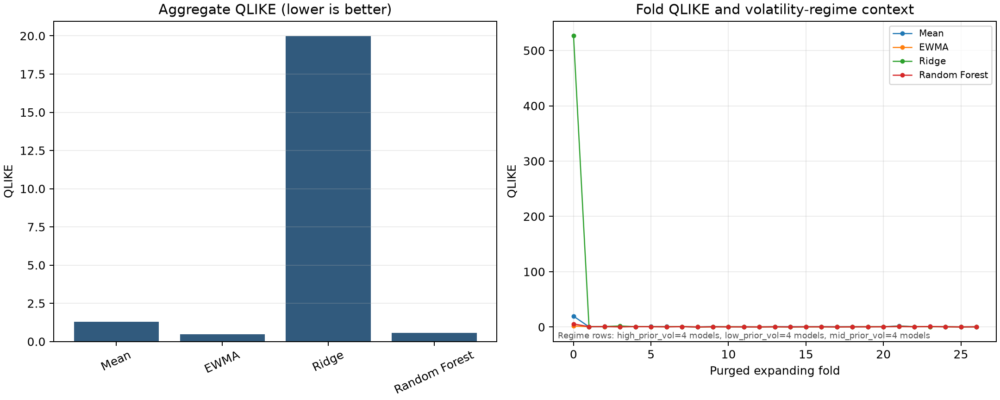

# SPY Public-Market Model Validation

[](https://github.com/lijiaweiphilip-web/spy-public-market-model-validation/actions/workflows/ci.yml) [](https://www.python.org/) [](LICENSE)

## Research question

Can simple historical, EWMA and machine-learning models forecast a five-trading-day realised-variance proxy from SPY daily **adjusted-close** data under a strict temporal protocol? The reference design uses **27 purged expanding walk-forward folds**, fixed hyperparameters, **no random split**, and **no test-set tuning**. Negative Ridge results and stress-period instability remain visible.

This is a model-validation research project, not a trading strategy. It makes no alpha, return, Sharpe, P&L, portfolio-performance, live-trading or investment-advice claim.

## Models and evidence

- Historical mean and a fixed, **non-anticipating EWMA lambda=0.94** baseline (a temporal availability rule, not a causal-inference claim).
- Ridge and Random Forest on a log target with an inner temporal calibration block inside each outer training set.
- Five-day target, purged labels, train-derived regimes, QLIKE/RMSE, calibration bins, stability, failure analysis and illustrative decision-cost sensitivity.
- Every canonical artifact is hashed after reports, environment and figures are written.

`spy-validate validate` is a generic validator for this repository's flat run
schema: it recomputes the derived metric tables from point-level predictions.
`validate-reference` is stricter and additionally checks the checked-in SPY
contract (27 folds, four canonical models and 1,620 OOF rows per model).

## Canonical reference results

The table below is generated from `results/reference_run/aggregate_metrics.csv` by the canonical private audit run. Lower RMSE/QLIKE is better; `calibration_ratio` is the mean prediction divided by mean actual and is descriptive, not a calibration guarantee.

<!-- BEGIN CANONICAL_RESULTS -->
| Model | RMSE | QLIKE | Calibration ratio |
|---|---:|---:|---:|
| historical mean | 0.002404 | 1.297086 | 0.865878 |
| EWMA (lambda=0.94) | 0.002123 | 0.490342 | 1.000233 |
| Ridge | 0.002442 | 19.969421 | 0.894873 |
| Random Forest | 0.002294 | 0.577410 | 0.794853 |
<!-- END CANONICAL_RESULTS -->

<!-- BEGIN CANONICAL_INTERPRETATION -->
Fixed EWMA has the strongest aggregate RMSE/QLIKE in this reference run; Random Forest has the strongest rank correlation (0.631) but does not dominate the finance baseline, and Ridge exhibits stress-period instability.

Fold-bootstrap differences versus the historical mean for EWMA were RMSE [-0.000309, -0.000027] and QLIKE [-2.146544, -0.107434] (lower is better; descriptive intervals for this reference run).
<!-- END CANONICAL_INTERPRETATION -->

The canonical table is refreshed only from a single final Python 3.12 run; it is not assembled from mixed historical artifacts.

## Reproducibility tiers

1. **Tier 1 - public synthetic/CI:** synthetic adjusted-close data runs the complete feature, fold, model, report, manifest and tamper-validation path.
2. **Tier 2 - live vendor rerun:** Yahoo adjusted-close retrieval is subject to vendor revisions and endpoint availability.
3. **Tier 3 - canonical audit rerun:** the exact raw vendor snapshot is retained privately by SHA-256 and rerun with the locked Python 3.12 environment; raw vendor bytes and point-level predictions are not redistributed by default.

## Install and run

```bash
python -m venv .venv
# Windows: .venv\Scripts\activate
# macOS/Linux: source .venv/bin/activate
python -m pip install -e .[dev]
pytest --cov=spy_validation --cov-report=term-missing --cov-fail-under=80
```

## Quick demo

The public synthetic demo is a deterministic functionality/reproducibility check, not SPY evidence:

```bash
python -m pip install -e .[dev]
spy-validate demo --output-dir runs/demo
spy-validate validate --run-dir runs/demo --source-path runs/demo/synthetic_adjusted_close.csv
# Strictly validate the checked-in canonical public reference bundle
spy-validate validate-reference --reference-dir results/reference_run
```

It generates price-only synthetic adjusted-close data, then derives targets, purged folds, model outputs, reports and hashes through the same pipeline used for the private audit. Synthetic metrics must not be combined with the canonical SPY table.

With a local Yahoo chart JSON:

```bash
spy-validate run --config configs/default.json --input-json /path/to/spy_yahoo_chart.json --output-dir runs/reference_run
spy-validate validate --run-dir runs/reference_run --source-path /path/to/spy_yahoo_chart.json
```

The CSV alternative requires `date` and `adjusted_close` columns. Raw-close-only Yahoo payloads are rejected.

## Read next

- [`docs/MATHEMATICAL_CONTRACT.md`](docs/MATHEMATICAL_CONTRACT.md) — definitions, assumptions, purge rule and fold-level uncertainty unit.
- [`docs/METHODOLOGY.md`](docs/METHODOLOGY.md)
- [`docs/CALIBRATION_AUDIT.md`](docs/CALIBRATION_AUDIT.md)
- [`docs/DATA_AND_REPRODUCIBILITY.md`](docs/DATA_AND_REPRODUCIBILITY.md)
- [`docs/LIMITATIONS.md`](docs/LIMITATIONS.md)
- [`FUTURE_WORK.md`](FUTURE_WORK.md)
- [`CHANGELOG.md`](CHANGELOG.md)
- [`results/reference_run/REPORT.md`](results/reference_run/REPORT.md)
- [`results/reference_run/PUBLIC_REFERENCE_MANIFEST.json`](results/reference_run/PUBLIC_REFERENCE_MANIFEST.json)
- [`schemas/public_reference_manifest.schema.json`](schemas/public_reference_manifest.schema.json)
- [`schemas/math_claims.schema.json`](schemas/math_claims.schema.json)
- [`docs/REFERENCES.md`](docs/REFERENCES.md)


